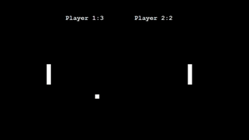

# 🏓 Ping Pong Game – Python Turtle

This is my first Ping Pong game built using **Python Turtle**.  
It includes simple paddle controls, scoring system, and win detection.

## 🚀 Features
- Two-player Ping Pong  
- Keyboard controls  
  - **Player 1:** W (Up), S (Down)  
  - **Player 2:** Up / Down arrow keys  
- Scoreboard  
- Game ends when a player reaches 5 points

  ## 📌 Requirements

    -Python 3.x

     -Turtle module (comes pre-installed with Python)

## 🧠 Future Improvements

-Add sounds

-Add Start/Restart menu

-Add difficulty levels or AI paddle


## 🎮 Game Demo

<p align="center">
  
</p>


## 🎮 How to Run
1. Install Python (if not installed)
2. Run the game with:

```bash
python pingpong.py

